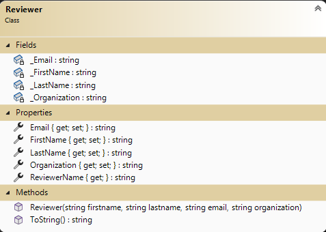
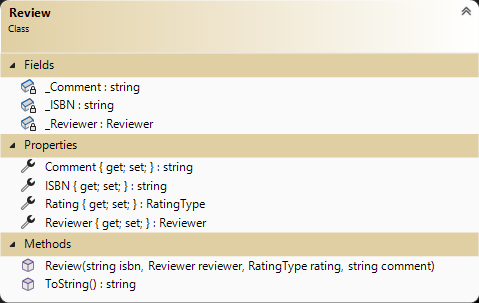

# OOP Training

> This is the first of a set of exercises that follow the evolution of a program to manage renovation projects. This set is cumulative and will build upon previous exercises.

## Overview

Your task is to generate a set of simple data types to represent the primary objects for managing renovation projects.

For this exercise, place all the required property data types in the namespace `BookSystem` and ensure that they are `public`. Create your project as a **class library** (.NET Core 8). You have been supplied a Unit Tests project that will inform you if your work will meet specifications. **Ensure you follow the given class diagrams for the Unit Tests to work.**

### General Validation Rules

All validation is to be performed by throwing exceptions. Here are some general requirements.

- Exceptions must have meaningful error messages with keywords (ex: positive, minimum).
- Use `ArgumentException()` for parameter value errors.
- Error messages must include details about the limits for acceptable values.
- Numerics must always be positive and non-zero numbers. Numerics are to be in whole number increments (eg: 254).
- All string information must contain text unless explicitly stated as optional. Null, empty, and plain white-space text is not allowed. Sanitize your strings by trimming the leading and trailing whitespace.


### Unit Testing Code 

Unit testing code has been provided for you and can be located in the zip file in this folder. The zip file is called: `BooksUnitTestEx1.zip`. Download the file; unzip the file; move the `BooksUnitTestEx1` folder to your solution; add the unit test project reference to your solution. Depending on any additional instructions from your instructor, you may need to update the project reference dependency and using statements.

### The `Author`

Author contains the characteristics for an author. The following is class information:

- **FirstName** (e.g.: "Lowand") - Identifies the author's first name.
- **Lastname** (e.g: "Behold") - Identifies the author's last name.
- **ContactUrl** (e.g. "LowandBehold.fantasy.ca") - Identifies the web site of the author.
- **ResidentCity** - Current city author is residing.
- **ResidentCountry** - Current country author is residing


 You will need a greedy constructor for this class. Properties getters and setters are public. All data validation is to be placed within the properties. Some properties only have a getter, because they develop their values based on the state of the Author. **Read-Only properties are not to store data.** Create an overloaded .ToString() method for the class to display all the instance values in a comma separated value string (value order must match constructor parameter list).


Note the following:

Regular expressions are a way of matching a string to an acceptable pattern. Regular expressions (or Regex for short) consists of many special
characters and combination identifiers with special meanings.  There are various coding ways to use a regex in your program. ***This is `not` a course on creating regex expressions.*** The following code is an example.

```csharp
    string pattern = @"your pattern";
    Regex regex = new Regex(pattern);

    //using pattern in a test
    //IsMatch return boolean true or false
    if (regex.IsMatch(yourinputvalue))
    {
       ...
    }
```
- Simple Regular Expression for url: "(https?://www)?[a-zA-Z0-9}]+\.\w{2,}(?!\.)"
- Meaning:
  - (...)? means optional, the ? after s meaning the s is optional
  - [...] one of the indicated characters,  
  - `+` at least one of
  - \ is an escape character use when the following character is not to be interpeted as a wild card character
  - \w{2,} two or more word characters
  - (?!x) negative lookahead for the character indicated by x

### The `Reveiwer`

Reviewer contains the characteristics for a reviewer. The following is class information:

- **FirstName** (e.g.: "Bork") - Identifies the review's first name.
- **Lastname** (e.g: "Wormm") - Identifies the review's last name.
- **Email** (e.g. "BorkWormm@treepress.ca") - Identifies the email address of the reviewer.
- **Organization** (e.g. TreePress publications) - Organization of the reviewer, optional. Reviewer can be independent.

 You will need a greedy constructor for this class. Properties getters and setters are public. All data validation is to be placed within the properties. Some properties only have a getter, because they develop their values based on the state of the Reviewer. **Read-Only properties are not to store data.** Create an overloaded .ToString() method for the class to display all the instance values in a comma separated value string (value order must match constructor parameter list).



Note the following

You will be required to research a simple regular expression to validate the Email. You may use the internet to discover a simple email address expression.

### The `RatingType`

Rating recommendation for the book. 


### The `Review`

Review contains the characteristics for a review. The following is class information:

- **ISBN** (e.g.: "978-0-7653-8669-4") - Identifies the book identificate number.
- **Reviewer** (e.g: instance of reviewer) - Identifies the reviewer.
- **Rating** (e.g. "Buy") - Identifies the enum value of the reviewer recommendation.
- **Comment** (e.g. "... great read for a lazy day by the pool") - Reviewer comment.

 You will need a greedy constructor for this class. Properties getters and setters are public. All data validation is to be placed within the properties. Rating is to be implemented using auto-implementation as there is no validaiton. Some properties only have a getter, because they develop their values based on the state of the Reviewer. **Read-Only properties are not to store data.** Create an overloaded .ToString() method for the class to display all the instance values in a comma separated value string (value order must match constructor parameter list).




### The `Unit Tests`

A unit testing project called `BooksUnitTestsEx1` has been supplied for this exercise. Add it to your solution. The tests have been commented out. As you code items in your class you can uncomment the appropriate unit test to evaluate your code. There is a separate unit test class for each of your classes. Check the unit test for the type of exception that is expected to be thrown. The unit tests have been divided into class components.

----

## Evaluation

> ***NOTE:** Your code **must** compile. Solutions that do not compile will receive an automatic mark of zero (0).*
> 
> If you are unable to get a portion of the assignment to compile or work, you should:
> - Comment out the  portion of code
> - Identify the reason for the commented portion (such *as does not compile* or *does not work cause an abort*)

Your assignment will be marked based upon the following weights. See the [general rubric](../../README.md#generalized-marking-rubric) for details.

| Earned | Weight | Deliverable/Requirement | Comments |
| ---- | ----- | --------- | ------- |
|  | 5 | Author |   |
|  | 5 | Reviewer |   |
|  | 5 | Review |   |
|  | -5 | Other concerns and penalties (Examples but not limited to: commits do not reflect reflect incremental development; unstructure code; unit tests not used; other instuctor requirements; class standards; ...) max -5 |   |
| ---- | ----- | --------- | ------- |
|  | **15** | **Total ** |    |

----
[Return to exercises](../README.md)
